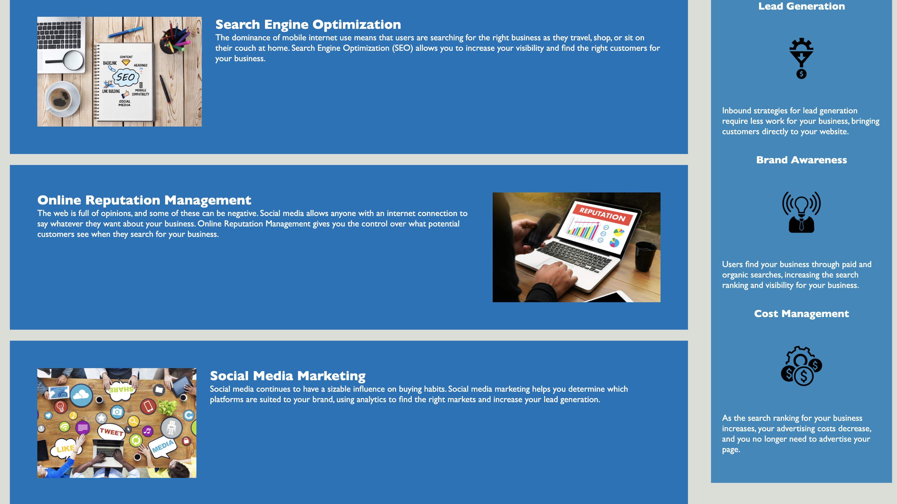

01 HTML CSS Git: code Refactor

* [Abstract](#abstract)
* [Details ](#details)
* [What I Learned](#what-i-learned)
* [Installation and Usage](#installation-and-usa)
* [License](#license)

# Abstract

Horiseon, an SEO service, needed the code for their home page refactored. This was achieved by adding semantic tags and accessibility features to the HTML, as well as consolidating and organizing the CSS, while also addressing functionality issues, such as broken links. The result is the same visual result achieved by cleaner and better-functioning code. 

The finished product has been deployed on Github, and can be viewed here: https://tomekregulski.github.io/hw_01/

# Details

This project is the result of a work order to refactor code for the home page for Horiseon, a company providing SEO, Awareness and Growth services for a variety of brands. 

The issue was that, while the visual result of the page was hitting their mark, the code itself was missing semantic elements, made use of unnecessary CSS classes, and lacked crucial accessibility features. 

The code in this repo represents the results of my work addressing these issues. 

Semantic HTML was applied in all instances that seemed appropriate, which also allowed for the removal of many CSS class names. I also added in the required alt text for all images, and fixed a broken nav link. The result is HTML code that reads clearly from top to bottom, will be more responsive to search enginges, and should present no issues for those accessing the page through assistive technology. 

Likewise, the CSS style sheet, though technically functional, was in need of refactoring, consolidation, and organization. Updating the HTML with semantic tags allowed for the CSS code to directly reference unique elements, rather than relying on class names (for the most part). Once this was updated, I organized the code into clear sections and consolidated it wherever possible.

All of this work was completed with the page loaded through a live server, so I could be sure that the styling and organization of the page was preserved with every change that I made. 

# What I Learned

This project helped solidfy in my mind how semantic HTML can be applied, and how it makes the code itself much cleaner and readable, in addition to the benefits it provides for those accessing the page with assistive technology, as well as how the page performs in search results. 

With this project, I took my time to look at every opportunity to reasonably apply these ideas, as well as to find as many unneeded CSS class names as I could. This helped me build a higher sense for when these elements are actually needed. 

Throughout all of this, I kept the preservation of the end-product as a top objective. I saw no reason for any of it to change, and so I strived to avoid this wherever possible, and believe that I achieved that. 

Finally, I now better see how well-structured code can read very clearly. I took some time to read through and try to visualize in my mind the parts of the page that each element affected. This is a very interesting exercise. 

As such, I hope that this project stands out as utilizing a DRY approach to coding as means to achieve the same result as the original code, while also introduce a higher degree of readibility, accessibility, and search engine optimization. 

# Installation and Use

Clone the repo and open the folder in the code editor of your choice. 

# License

MIT License

Copyright (c) [2021] [Tomek Regulski]

Permission is hereby granted, free of charge, to any person obtaining a copy
of this software and associated documentation files (the "Software"), to deal
in the Software without restriction, including without limitation the rights
to use, copy, modify, merge, publish, distribute, sublicense, and/or sell
copies of the Software, and to permit persons to whom the Software is
furnished to do so, subject to the following conditions:

The above copyright notice and this permission notice shall be included in all
copies or substantial portions of the Software.

THE SOFTWARE IS PROVIDED "AS IS", WITHOUT WARRANTY OF ANY KIND, EXPRESS OR
IMPLIED, INCLUDING BUT NOT LIMITED TO THE WARRANTIES OF MERCHANTABILITY,
FITNESS FOR A PARTICULAR PURPOSE AND NONINFRINGEMENT. IN NO EVENT SHALL THE
AUTHORS OR COPYRIGHT HOLDERS BE LIABLE FOR ANY CLAIM, DAMAGES OR OTHER
LIABILITY, WHETHER IN AN ACTION OF CONTRACT, TORT OR OTHERWISE, ARISING FROM,
OUT OF OR IN CONNECTION WITH THE SOFTWARE OR THE USE OR OTHER DEALINGS IN THE
SOFTWARE.
